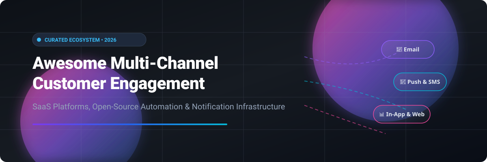

  

  
  
  
  
  

# 🚀 Awesome Multi-Channel Customer Engagement & Marketing Ecosystem

> A curated directory of premier **Commercial Customer Engagement SaaS Platforms** and **Open-Source Marketing Automation Projects** for orchestrating multi-channel messaging across email, SMS, push notifications, in-app messaging, webhooks, and live chat.

---

## 📌 Table of Contents
- [🏢 SaaS & Hosted Commercial Platforms](#-saas--hosted-commercial-platforms)
- [💻 Open-Source GitHub Projects](#-open-source-github-projects)
  - [🔔 Notification Infrastructure & Messaging](#-notification-infrastructure--messaging)
  - [📊 Analytics, Session Replay & Event Data](#-analytics-session-replay--event-data)
  - [💬 Customer Engagement & Live Chat](#-customer-engagement--live-chat)
  - [📧 Marketing Automation & Newsletter Platforms](#-marketing-automation--newsletter-platforms)
- [🤝 How to Contribute](#-how-to-contribute)
- [⚠️ Disclaimer](#%EF%B8%8F-disclaimer)
- [⭐ Star History](#%EF%B8%8F-star-history)
- [💖 Support & Community](#-support--community)

---

## 🏢 SaaS & Hosted Commercial Platforms

> 💡 **Market Overview**: The Global Customer Engagement & Omnichannel Marketing Automation software market is estimated at **~$22.5 Billion in 2026** and is projected to expand to **~$45 Billion+ by 2032** (CAGR ~12–14%). The sector is **moderately to highly fragmented**, characterized by intense competition between public cloud giants (Amazon Pinpoint), enterprise engagement leaders (Klaviyo, Braze, Iterable), mobile retention specialists (CleverTap, Airship, MoEngage), behavioral automation platforms (Customer.io, OneSignal), and self-hosted open-source stacks.

*The table below is sorted by **Company Size (Revenue / Valuation)** in descending order.*

| 🏷️ Platform | 🎯 Description & Core Focus | 💰 Company Size (Revenue / Valuation) | 💵 Starting Price | 🎁 Free Tier / Free Trial Limits |
| :--- | :--- | :--- | :--- | :--- |
| **[Amazon Pinpoint](https://aws.amazon.com/pinpoint/)** | **AWS's engagement service** — targeted multi-channel messaging (email, push, SMS) with analytics. **Best for AWS-native scale**. | **~$2.1 Trillion** (Parent) / **~$600 Billion** (AWS Pinpoint est. ~$100M+ ARR) | **Pay-as-you-go** ($0.0012/endpoint/mo beyond free tier; $1.00 per 10k emails) | **Free forever** (5,000 endpoints, 1M push notifications/mo, 15k in-app requests & 100M events) |
| **[Klaviyo](https://www.klaviyo.com/)** | **E-commerce marketing platform** — automated email & SMS workflows with deep Shopify integration. **Best for e-commerce brands**. | **~$4.7 Billion** (Market Cap) / **~$1.2 Billion** (Annual Revenue) | Starts at **$20/month** (up to 500 active profiles) | **Free forever** (250 active profiles, 500 email sends/mo, 150 SMS/MMS credits) |
| **[Braze](https://www.braze.com/)** | **The leading customer engagement platform** — real-time cross-channel messaging & orchestration. **Best for enterprise scale**. | **~$3.0 Billion** (Market Cap) / **~$738 Million** (Annual Revenue) | Custom starting at **~$30,000/year** (~$2,500/month) for ~50k MAUs | **14-day free trial** (access to campaign templates, AI tools & guided product tours; no free-forever plan) |
| **[Iterable](https://iterable.com/)** | **Cross-channel marketing platform** — email, SMS, push & in-app with workflow automation. **Best for growth-stage teams**. | **~$2.0 Billion** (Valuation) / **~$150 Million+** (ARR) | Custom starting at **~$50,000/year** (~$4,166/month) | **No free-forever plan or public trial** (demo / proof-of-concept available upon request) |
| **[CleverTap](https://clevertap.com/)** | **Omnichannel retention platform** — integrated analytics & user engagement. **Best for mobile app retention**. | **~$775 Million** (Valuation) / **~$100 Million+** (ARR) | Essentials plan starts at **$75/month** (up to 5,000 MAUs) | **30-day free trial** (up to 100,000 MAUs with sample demo data; no free-forever plan) |
| **[Airship](https://www.airship.com/)** | **Enterprise mobile engagement platform** — push, in-app messaging, SMS & email. **Best for mobile-first enterprises**. | **~$500 Million+** (Valuation) / **~$120 Million+** (ARR) | Custom starting at **~$25,000/year** (~$2,083/month) | **30-day free trial** (available upon sales request/demo; no free-forever plan) |
| **[MoEngage](https://www.moengage.com/)** | **Insights-led customer engagement platform** — AI-driven omnichannel marketing. **Best for mobile brands**. | **~$500 Million** (Valuation) / **~$70 Million+** (ARR) | Standard plan starts at **$999/month** (up to 10,000 MTUs) | **30-day free trial** (available upon sales request/demo; no free-forever plan) |
| **[Customer.io](https://customer.io/)** | **Behavioral messaging platform** — automated email, push & SMS triggered by user actions. **Best for product-led SaaS**. | **~$300 Million+** (Valuation) / **~$60 Million+** (ARR) | Essentials plan starts at **$100/month** (up to 5,000 profiles & 1k SMS credits) | **14-day free trial** (allows sending up to 5,000 messages across channels; no free-forever plan) |
| **[OneSignal](https://onesignal.com/)** | **Push notification platform** — mobile, web push, in-app & email notifications. **Best for mobile messaging**. | **~$200 Million+** (Valuation) / **~$40 Million+** (ARR) | Growth plan starts at **$9/month** (+$0.012/mobile MAU) | **Free forever** (1,000 mobile MAUs, 10,000 web push subscribers, 10,000 emails/mo) |
| **[Leanplum](https://www.leanplum.com/)** | **Mobile engagement platform** — push, in-app, email & mobile A/B testing (acquired by CleverTap). **Best for mobile apps**. | **~$150 Million** (Acquisition) / **~$30 Million+** (ARR) | Custom starting at **~$30,000/year** (~$2,500/month) | **14-day free trial** (available upon sales request/demo; no free-forever plan) |

---

## 💻 Open-Source GitHub Projects

> Open-source software powers modern customer communication and analytics stacks. Below is a comprehensive list of top self-hosted marketing platforms, notification engines, analytics suites, and chat systems, sorted by **GitHub Star Count (descending)**.

---

### 🔔 Notification Infrastructure & Messaging

- **[Novu](https://github.com/novuhq/novu)** 
  **Open-source notification infrastructure**, MIT licensed . **Unified API for email, SMS, push, in-app inbox, Slack, Teams, Discord & WhatsApp** . Visual workflow editor with conditions, delays & digests . **Best for multi-channel developer notifications**.

- **[Apprise](https://github.com/caronc/apprise)** 
  **Push notification library for 100+ services**, MIT licensed . **One unified Python & CLI wrapper for Telegram, Discord, Slack, SMS, email & more** . **Best for multi-service alerts**.

---

### 📊 Analytics, Session Replay & Event Data

- **[Umami](https://github.com/umami-software/umami)** 
  **Privacy-friendly website analytics**, MIT licensed . **Fast, lightweight, cookie-free analytics suite** . **Best for simple, privacy-focused analytics**.

- **[PostHog](https://github.com/PostHog/posthog)** 
  **Open-source product analytics platform**, MIT licensed . **Product analytics, funnels, session replay, feature flags & A/B testing** . The open-source Amplitude & Mixpanel alternative . **Best for deep product analytics**.

- **[Matomo](https://github.com/matomo-org/matomo)** 
  **Full-featured web analytics**, GPL-3.0 licensed . **Heatmaps, session recording, custom goals & data ownership** . The open-source Google Analytics alternative . **Best for enterprise privacy compliance**.

- **[Plausible](https://github.com/plausible/analytics)** 
  **Lightweight web analytics**, AGPL-3.0 licensed . **Cookie-free, GDPR/CCPA compliant tracking under 1KB script** . **Best for minimal overhead web analytics**.

- **[Formbricks](https://github.com/formbricks/formbricks)** 
  **Open-source survey & experience management**, AGPL-3.0 licensed . **In-app micro-surveys, feedback collection & user targeting** . **Best for user feedback & CSAT**.

- **[Jitsu](https://github.com/jitsucom/jitsu)** 
  **Open-source data collection platform**, MIT licensed . **Collect event streams and route data into data warehouses & APIs** . Open-source Segment alternative . **Best for event data pipelines**.

---

### 💬 Customer Engagement & Live Chat

- **[Chatwoot](https://github.com/chatwoot/chatwoot)** 
  **Open-source customer engagement suite**, MIT licensed . **Omnichannel inbox unifying live chat, email, WhatsApp, SMS & social channels** . Open-source Intercom & Zendesk alternative . **Best for customer support & engagement**.

- **[Erxes](https://github.com/erxes/erxes)** 
  **Open-source experience operating system**, AGPL-3.0 licensed . **Combines marketing automation, messaging, sales CRM & customer support in one suite** . **Best for all-in-one growth operations**.

---

### 📧 Marketing Automation & Newsletter Platforms

- **[Listmonk](https://github.com/knadh/listmonk)** 
  **High-performance newsletter & mailing list manager**, AGPL-3.0 licensed . **Single binary written in Go with PostgreSQL backend** . Sends millions of emails efficiently . **Best for newsletter publishing & broadcast mailing**.

- **[Mautic](https://github.com/mautic/mautic)** 
  **The leading open-source marketing automation platform**, GPL-3.0 licensed . **Email campaigns, landing pages, dynamic forms, lead scoring, segmentation & CRM integrations** . Open-source HubSpot alternative . **Best for end-to-end marketing automation**.

- **[Mailcow](https://github.com/mailcow/mailcow-dockerized)** 
  **Dockerized email server suite**, GPL-3.0 licensed . **Full email suite with DKIM, SPF, DMARC, rate-limiting & deliverability tools** . **Best for self-hosted email delivery infrastructure**.

- **[Mailtrain](https://github.com/Mailtrain-org/mailtrain)** 
  **Self-hosted newsletter application**, GPL-3.0 licensed . **Subscriber list management, segment filtering & custom field triggers** . **Best for self-hosted email list management**.

- **[SendPortal](https://github.com/mettle/sendportal)** 
  **Open-source email marketing software**, MIT licensed . **Laravel-based marketing application connected to SES, SendGrid, Postmark, Mailgun & SMS gateways** . **Best for self-hosted broadcast campaigns**.

- **[Keila](https://github.com/keila-io/keila)** 
  **Modern newsletter software**, AGPL-3.0 licensed . **Visual block editor, markdown support & privacy-focused click analytics** . **Best for modern newsletters**.

---

## 🤝 How to Contribute

Contributions are highly encouraged! Please follow these simple guidelines:

1. 🍴 **Fork the repository**.
2. 📝 **Add or update entries** in `README.md` maintaining table & badge formats.
3. 🔗 Include accurate factual descriptions, starting prices, free tier details, and links to official documentation.
4. 📬 **Submit a Pull Request** with a clear explanation of your additions.

---

## ⚠️ Disclaimer

- This directory is **community-curated** for educational and architectural reference purposes.
- **Data Compliance**: Customer engagement platforms process sensitive personally identifiable information (PII). Ensure proper security controls, consent mechanisms, and compliance with privacy regulations (GDPR, CCPA, CAN-SPAM).
- **Email Deliverability**: Self-hosted email solutions require warming up IPs, configuring SPF/DKIM/DMARC records, and monitoring domain reputations. Commercial platforms offer managed IP deliverability.

---

## ⭐ Star History

---

## 💖 Support & Community

Thank you for exploring this curated ecosystem! If you find this repository valuable for your marketing technology architecture:

- ⭐ **Star this repository** to help others discover it!
- 🍴 **Fork it** to customize it for your organization.
- 📢 **Share it** with marketing engineers, growth teams, and architects.
- ☕ **Sponsor / Buy me a coffee**: Support ongoing curation and maintenance via [GitHub Sponsors](https://github.com/sponsors/ishandutta2007).

  

---
**Made with ❤️ for marketing engineers, growth teams, and digital engagement architects.**
